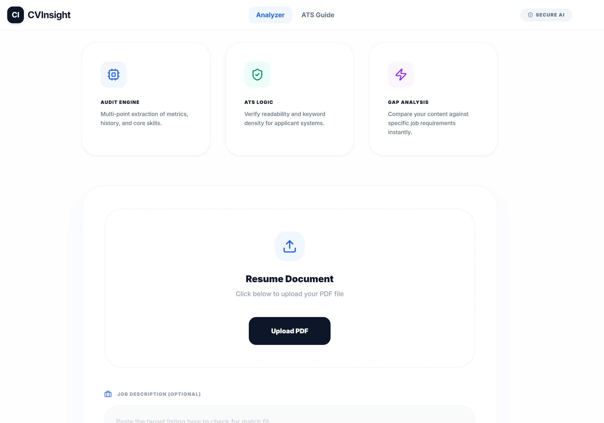
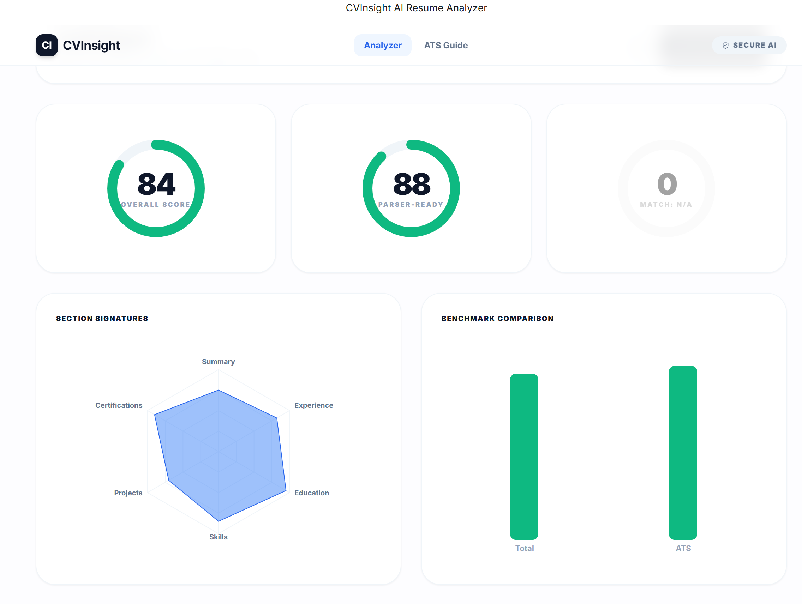

# CVInsight – AI Resume Analyzer

CVInsight is an **AI-powered resume analyzer** that evaluates resumes, provides detailed feedback, scoring, and optimization suggestions.  
It can also match your resume to a job description and highlight areas for improvement, helping candidates optimize their resumes for real-world applications.

---

## 🚀 Features

- 📄 Upload and analyze resumes in PDF, DOCX, or TXT format  
- 🧩 Detect sections: Summary, Experience, Education, Skills, Certifications, Projects  
- 📝 Grammar, clarity, and phrasing improvement suggestions  
- 🎯 ATS (Applicant Tracking System) optimization and missing keyword detection  
- 📊 Detailed section-wise scoring and overall resume score  
- 🧠 Job description matching (optional)  
- 📈 Visual reports highlighting strengths, weaknesses, and recommendations  
- 💾 Export analysis report as PDF  

View Link: https://cvinsight-ai-resume-analyzer.vercel.app/ 
---

## 🖼️ Screenshots

### Home / Upload Resume


### Report & Recommendations



---

## 🛠️ Run Locally

### Prerequisites

- Node.js (v18+ recommended)  
- npm (comes with Node.js)  
- Google Gemini API key

---

## Clone Repository and Install Dependencies
```bash
git clone https://github.com/mohakamran/cvinsight-ai-resume-analyzer.git
cd cvinsight-ai-resume-analyzer
```

### API Key Setup
After cloning project, get api key from google studio https://studio.google.ai/
- Create a file named .env.local in the project root
- Add your Gemini API key:
- GEMINI_API_KEY=your_gemini_api_key_here or API_KEY=your_gemini_api_key_here 

```bash
npm install
npm run dev
